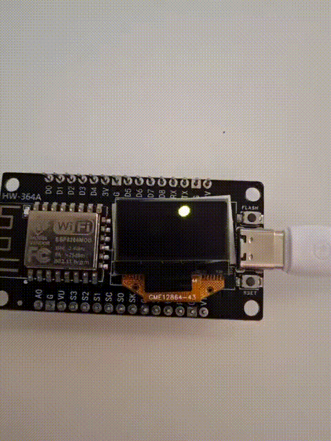
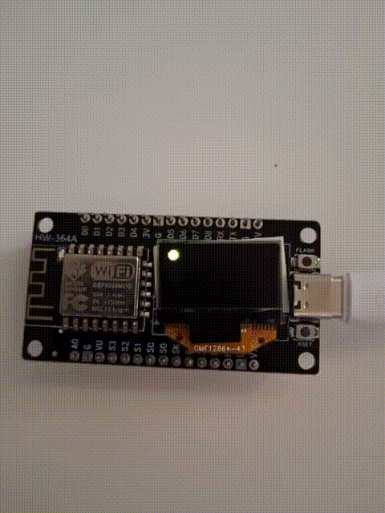

# Simple Animation Project

ESP8266 + OLED demo project that renders a small animated ball on a 128x64 SSD1306 display. The current sketch uses the Arduino framework with PlatformIO and is designed for an ESP-12E board.

## Features

- Bouncing ball animation on a monochrome OLED display
- ESP8266 compatible build using PlatformIO
- I2C display initialization through `Wire`
- Frame-by-frame redraw loop with simple motion physics
- Adjustable animation speed, ball size, and starting position in code

## Hardware

- ESP8266 ESP-12E board
- SSD1306 OLED display, 128x64, I2C
- Typical I2C address: `0x3C`

## Wiring

The sketch initializes I2C with these pins:

- SDA: GPIO14
- SCL: GPIO12

Connect the OLED display to the board according to your module pinout and power requirements.

## How It Works

The program clears the screen, draws a filled circle, sends the frame to the display, then updates the ball position. When the ball reaches a screen edge, the direction changes so the motion appears to bounce around the OLED panel.

## Build And Upload

1. Open the project in PlatformIO.
2. Select the `esp12e` environment.
3. Build and upload to the board.

The active environment is defined in [platformio.ini](platformio.ini).

## Customization

You can change the animation behavior directly in [src/main.cpp](src/main.cpp):

- `ballX` and `ballY` control the start position
- `ballSpeedX` and `ballSpeedY` control movement speed and direction
- `ballRadius` controls the ball size
- `delay(10)` controls the frame rate

## GIFs

### Demo GIFs

   

 <b>Displaying animation</b>

   

 <b>Resetting animation</b>

## Libraries

The project includes these libraries in `lib/`:

- Adafruit GFX
- Adafruit SSD1306
- Adafruit BusIO

## Notes

- The display is initialized at address `0x3C`.
- If the OLED does not start, the sketch currently stops in an infinite loop during initialization failure.

## License

This project is licensed under the terms described in [license/license.md]

## Contributing

Contributions are welcome! Please feel free to submit a pull request.
